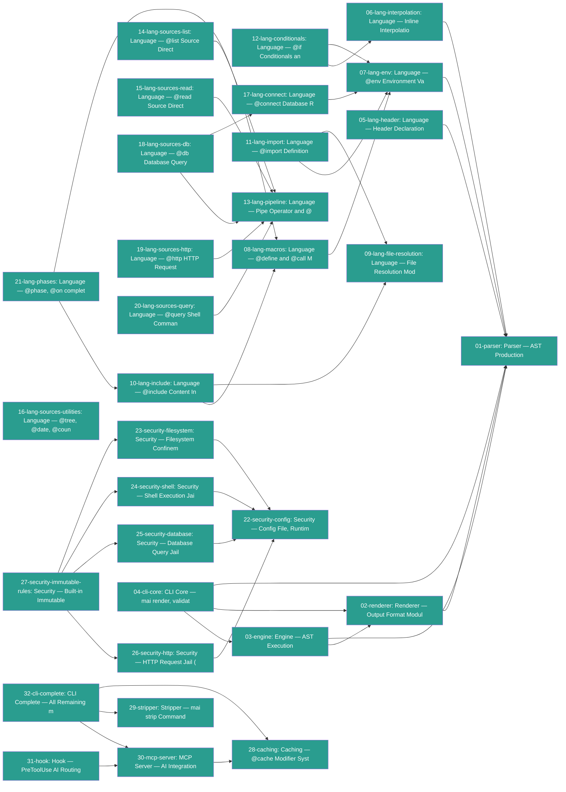

# Connections

## Path Tree

```
Language/Conditionals
  └── 12-lang-conditionals  (complete)
Language/Connect
  └── 17-lang-connect  (complete)
Language/Env
  └── 07-lang-env  (complete)
Language/FileResolution
  └── 09-lang-file-resolution  (complete)
Language/Header
  └── 05-lang-header  (complete)
Language/Import
  └── 11-lang-import  (complete)
Language/Include
  └── 10-lang-include  (complete)
Language/Interpolation
  └── 06-lang-interpolation  (complete)
Language/Macros
  └── 08-lang-macros  (complete)
Language/Phases
  └── 21-lang-phases  (complete)
Language/Pipeline
  └── 13-lang-pipeline  (complete)
Language/Sources
  ├── 14-lang-sources-list  (complete)
  ├── 15-lang-sources-read  (complete)
  ├── 16-lang-sources-utilities  (complete)
  ├── 18-lang-sources-db  (complete)
  ├── 19-lang-sources-http  (complete)
  └── 20-lang-sources-query  (complete)
Security
  ├── 22-security-config  (complete)
  ├── 23-security-filesystem  (complete)
  ├── 24-security-shell  (complete)
  ├── 25-security-database  (complete)
  ├── 26-security-http  (complete)
  └── 27-security-immutable-rules  (complete)
Toolchain/CLI
  ├── 04-cli-core  (complete)
  └── 32-cli-complete  (complete)
Toolchain/Cache
  └── 28-caching  (complete)
Toolchain/Engine
  └── 03-engine  (complete)
Toolchain/Hook
  └── 31-hook  (complete)
Toolchain/MCP
  └── 30-mcp-server  (complete)
Toolchain/Parser
  └── 01-parser  (complete)
Toolchain/Renderer
  └── 02-renderer  (complete)
Toolchain/Stripper
  └── 29-stripper  (complete)
```

## Dependency Graph



## Source File Overlap

- `packages/core/src/commands/init.ts`: 32-cli-complete, 31-hook
- `packages/core/src/commands/strip.ts`: 32-cli-complete, 29-stripper
- `packages/engine/src/cache.ts`: 28-caching, 03-engine
- `packages/engine/src/conditions.ts`: 12-lang-conditionals, 06-lang-interpolation, 03-engine
- `packages/engine/src/context.ts`: 17-lang-connect, 07-lang-env, 03-engine
- `packages/engine/src/engine.ts`: 09-lang-file-resolution, 11-lang-import, 10-lang-include, 21-lang-phases, 14-lang-sources-list, 15-lang-sources-read, 16-lang-sources-utilities, 18-lang-sources-db, 19-lang-sources-http, 03-engine
- `packages/engine/src/macros.ts`: 08-lang-macros, 03-engine
- `packages/engine/src/pipe.ts`: 13-lang-pipeline, 03-engine
- `packages/engine/src/shell.ts`: 20-lang-sources-query, 03-engine
- `packages/parser/src/directives/call.ts`: 08-lang-macros, 01-parser
- `packages/parser/src/directives/connect.ts`: 17-lang-connect, 01-parser
- `packages/parser/src/directives/count.ts`: 16-lang-sources-utilities, 01-parser
- `packages/parser/src/directives/date.ts`: 16-lang-sources-utilities, 01-parser
- `packages/parser/src/directives/db.ts`: 18-lang-sources-db, 01-parser
- `packages/parser/src/directives/define.ts`: 08-lang-macros, 01-parser
- `packages/parser/src/directives/env.ts`: 07-lang-env, 01-parser
- `packages/parser/src/directives/graph.ts`: 21-lang-phases, 01-parser
- `packages/parser/src/directives/header.ts`: 05-lang-header, 01-parser
- `packages/parser/src/directives/http.ts`: 19-lang-sources-http, 01-parser
- `packages/parser/src/directives/if.ts`: 12-lang-conditionals, 01-parser
- `packages/parser/src/directives/import.ts`: 11-lang-import, 01-parser
- `packages/parser/src/directives/include.ts`: 10-lang-include, 01-parser
- `packages/parser/src/directives/list.ts`: 14-lang-sources-list, 01-parser
- `packages/parser/src/directives/phase.ts`: 21-lang-phases, 01-parser
- `packages/parser/src/directives/pipe.ts`: 13-lang-pipeline, 01-parser
- `packages/parser/src/directives/query.ts`: 20-lang-sources-query, 01-parser
- `packages/parser/src/directives/read.ts`: 15-lang-sources-read, 01-parser
- `packages/parser/src/directives/render.ts`: 13-lang-pipeline, 01-parser
- `packages/parser/src/directives/tree.ts`: 16-lang-sources-utilities, 01-parser
- `packages/renderer/src/renderer.ts`: 13-lang-pipeline, 02-renderer

## Warnings

(none)
