# MDD Connections Map

## Path Tree

```
AI
  ├── ConsumerMode
  │     └── ConsumerMode  34-ai-consumer-mode  draft
  ├── ContextBudget
  │     └── ContextBudget  36-ai-context-budget  draft
  ├── Concepts
  │     └── Concepts  37-ai-concepts  draft
  ├── Constraints
  │     └── Constraints  38-ai-constraints  draft
  ├── Format
  │     └── Format  39-ai-format  draft
  └── Prompt
        └── Prompt  35-ai-prompt  draft

Engine
  ├── Conditions
  │     └── Conditions  47-skill-context-variables  complete
  └── Security
        └── Security  48-shell-inline  complete

Integration
  └── MDD
        ├── MDD  45-mdd-markdownai-integration  draft
        └── MDD  46-mdd-token-optimization-analysis  draft

Language
  ├── Conditionals
  │     └── Conditionals  12-lang-conditionals  complete
  ├── Connect
  │     └── Connect  17-lang-connect  complete
  ├── Env
  │     └── Env  07-lang-env  complete
  ├── FileResolution
  │     └── FileResolution  09-lang-file-resolution  complete
  ├── Header
  │     └── Header  05-lang-header  complete
  ├── Import
  │     └── Import  11-lang-import  complete
  ├── Include
  │     └── Include  10-lang-include  complete
  ├── Interpolation
  │     └── Interpolation  06-lang-interpolation  complete
  ├── Macros
  │     └── Macros  08-lang-macros  complete
  ├── Phases
  │     └── Phases  21-lang-phases  complete
  ├── Pipeline
  │     └── Pipeline  13-lang-pipeline  complete
  └── Sources
        ├── Sources  14-lang-sources-list  complete
        ├── Sources  15-lang-sources-read  complete
        ├── Sources  16-lang-sources-utilities  complete
        ├── Sources  18-lang-sources-db  complete
        ├── Sources  19-lang-sources-http  complete
        └── Sources  20-lang-sources-query  complete

Security
  ├── Security  22-security-config  complete
  ├── Security  23-security-filesystem  complete
  ├── Security  24-security-shell  complete
  ├── Security  25-security-database  complete
  ├── Security  26-security-http  complete
  └── Security  27-security-immutable-rules  complete

Testing
  ├── AI-E2E
  │     └── AI-E2E  40-ai-e2e-accuracy  draft
  ├── E2E
  │     └── E2E  33-e2e-test-suite  complete
  └── MCP-E2E
        ├── MCP-E2E  41-mcp-e2e-protocol  draft
        ├── MCP-E2E  42-mcp-e2e-tools  draft
        ├── MCP-E2E  43-mcp-e2e-security  draft
        └── MCP-E2E  44-mcp-e2e-ai-integration  draft

Toolchain
  ├── Cache
  │     └── Cache  28-caching  complete
  ├── CLI
  │     ├── CLI  04-cli-core  complete
  │     └── CLI  32-cli-complete  complete
  ├── Engine
  │     └── Engine  03-engine  complete
  ├── Hook
  │     └── Hook  31-hook  complete
  ├── MCP
  │     └── MCP  30-mcp-server  complete
  ├── Parser
  │     └── Parser  01-parser  complete
  ├── Renderer
  │     └── Renderer  02-renderer  complete
  └── Stripper
        └── Stripper  29-stripper  complete

VS Code Extension
  ├── Foundation
  │     ├── Foundation  51-package-scaffold  complete
  │     ├── Foundation  52-language-definition  complete
  │     ├── Foundation  53-syntax-highlighting  complete
  │     ├── Foundation  54-snippets  complete
  │     └── Foundation  60-extension-settings  complete
  ├── Intelligence
  │     ├── Intelligence  55-completion-provider  complete
  │     ├── Intelligence  56-hover-provider  complete
  │     ├── Intelligence  57-definition-provider  complete
  │     └── Intelligence  58-reference-panel  complete
  └── Quality
        ├── Quality  59-diagnostics-provider  complete
        ├── Quality  61-test-suite  complete
        └── Quality  62-readme-and-marketplace  complete

engine (path case inconsistency - see Warnings)
  ├── conditions  50-match-operator  complete
  └── stdlib  49-stdlib  complete

DB
  ├── Query Language
  │     ├── Query Language  63-db-query-language  complete
  │     ├── Query Language  64-db-where-clause  complete
  │     ├── Query Language  65-db-aggregate-operation  complete
  │     └── Query Language  66-db-raw-escape-hatch  complete
  ├── Internals
  │     ├── Internals  67-db-queryplan-types  complete
  │     └── Internals  68-db-executor  complete
  ├── Adapters
  │     ├── Adapters  69-db-adapter-interface  draft
  │     ├── Adapters  70-db-mongodb-adapter  draft
  │     └── Adapters  71-db-sql-adapters  draft
  ├── Security
  │     └── Security  72-db-security  draft
  ├── Caching
  │     └── Caching  73-db-caching  draft
  └── Errors
        └── Errors  74-db-error-handling  draft
```

## Dependency Graph

```mermaid
graph TD
  d01[01-parser]:::complete
  d02[02-renderer]:::complete
  d03[03-engine]:::complete
  d04[04-cli-core]:::complete
  d05[05-lang-header]:::complete
  d06[06-lang-interpolation]:::complete
  d07[07-lang-env]:::complete
  d08[08-lang-macros]:::complete
  d09[09-lang-file-resolution]:::complete
  d10[10-lang-include]:::complete
  d11[11-lang-import]:::complete
  d12[12-lang-conditionals]:::complete
  d13[13-lang-pipeline]:::complete
  d14[14-lang-sources-list]:::complete
  d15[15-lang-sources-read]:::complete
  d16[16-lang-sources-utilities]:::complete
  d17[17-lang-connect]:::complete
  d18[18-lang-sources-db]:::complete
  d19[19-lang-sources-http]:::complete
  d20[20-lang-sources-query]:::complete
  d21[21-lang-phases]:::complete
  d22[22-security-config]:::complete
  d23[23-security-filesystem]:::complete
  d24[24-security-shell]:::complete
  d25[25-security-database]:::complete
  d26[26-security-http]:::complete
  d27[27-security-immutable-rules]:::complete
  d28[28-caching]:::complete
  d29[29-stripper]:::complete
  d30[30-mcp-server]:::complete
  d31[31-hook]:::complete
  d32[32-cli-complete]:::complete
  d33[33-e2e-test-suite]:::complete
  d34[34-ai-consumer-mode]:::draft
  d35[35-ai-prompt]:::draft
  d36[36-ai-context-budget]:::draft
  d37[37-ai-concepts]:::draft
  d38[38-ai-constraints]:::draft
  d39[39-ai-format]:::draft
  d40[40-ai-e2e-accuracy]:::draft
  d41[41-mcp-e2e-protocol]:::draft
  d42[42-mcp-e2e-tools]:::draft
  d43[43-mcp-e2e-security]:::draft
  d44[44-mcp-e2e-ai-integration]:::draft
  d45[45-mdd-markdownai-integration]:::draft
  d46[46-mdd-token-optimization-analysis]:::draft
  d47[47-skill-context-variables]:::complete
  d48[48-shell-inline]:::complete
  d49[49-stdlib]:::complete
  d50[50-match-operator]:::complete
  d51[51-package-scaffold]:::complete
  d52[52-language-definition]:::complete
  d53[53-syntax-highlighting]:::complete
  d54[54-snippets]:::complete
  d55[55-completion-provider]:::complete
  d56[56-hover-provider]:::complete
  d57[57-definition-provider]:::complete
  d58[58-reference-panel]:::complete
  d59[59-diagnostics-provider]:::complete
  d60[60-extension-settings]:::complete
  d61[61-test-suite]:::complete
  d62[62-readme-and-marketplace]:::complete
  d63[63-db-query-language]:::complete
  d64[64-db-where-clause]:::complete
  d65[65-db-aggregate-operation]:::complete
  d66[66-db-raw-escape-hatch]:::complete
  d67[67-db-queryplan-types]:::complete
  d68[68-db-executor]:::complete
  d69[69-db-adapter-interface]:::draft
  d70[70-db-mongodb-adapter]:::draft
  d71[71-db-sql-adapters]:::draft
  d72[72-db-security]:::draft
  d73[73-db-caching]:::draft
  d74[74-db-error-handling]:::draft

  d02 --> d01
  d03 --> d01
  d03 --> d02
  d04 --> d01
  d04 --> d02
  d04 --> d03
  d05 --> d01
  d06 --> d01
  d07 --> d01
  d08 --> d07
  d10 --> d09
  d10 --> d08
  d11 --> d09
  d11 --> d07
  d12 --> d07
  d12 --> d06
  d14 --> d13
  d15 --> d13
  d17 --> d07
  d18 --> d17
  d18 --> d13
  d19 --> d13
  d20 --> d13
  d21 --> d08
  d21 --> d10
  d23 --> d22
  d24 --> d22
  d25 --> d22
  d26 --> d22
  d27 --> d23
  d27 --> d24
  d27 --> d25
  d27 --> d26
  d30 --> d28
  d31 --> d30
  d32 --> d28
  d32 --> d29
  d32 --> d30
  d33 --> d04
  d33 --> d10
  d33 --> d11
  d33 --> d08
  d33 --> d12
  d33 --> d13
  d33 --> d14
  d33 --> d15
  d33 --> d16
  d33 --> d07
  d33 --> d21
  d33 --> d28
  d33 --> d29
  d33 --> d32
  d34 --> d12
  d34 --> d04
  d35 --> d01
  d35 --> d03
  d35 --> d34
  d36 --> d01
  d36 --> d03
  d36 --> d04
  d37 --> d01
  d37 --> d03
  d37 --> d34
  d38 --> d01
  d38 --> d03
  d38 --> d34
  d39 --> d02
  d39 --> d04
  d39 --> d30
  d40 --> d33
  d40 --> d34
  d40 --> d35
  d40 --> d36
  d40 --> d37
  d40 --> d38
  d40 --> d39
  d41 --> d30
  d41 --> d33
  d42 --> d30
  d42 --> d41
  d43 --> d22
  d43 --> d23
  d43 --> d27
  d43 --> d42
  d44 --> d30
  d44 --> d39
  d44 --> d38
  d44 --> d43
  d46 --> d45
  d47 --> d12
  d47 --> d30
  d48 --> d12
  d48 --> d20
  d48 --> d24
  d48 --> d47
  d49 --> d03
  d49 --> d06
  d49 --> d08
  d50 --> d03
  d52 --> d51
  d53 --> d52
  d54 --> d52
  d55 --> d51
  d55 --> d52
  d56 --> d55
  d57 --> d55
  d57 --> d56
  d58 --> d55
  d59 --> d55
  d61 --> d59
  d61 --> d60
  d62 --> d61
  d63 --> d17
  d63 --> d13
  d64 --> d63
  d65 --> d63
  d65 --> d64
  d66 --> d63
  d67 --> d64
  d67 --> d65
  d68 --> d67
  d69 --> d67
  d70 --> d69
  d71 --> d69
  d72 --> d68
  d72 --> d66
  d73 --> d68
  d73 --> d28
  d74 --> d68

  classDef complete fill:#00e5cc,color:#000
  classDef in_progress fill:#ffaa00,color:#000
  classDef draft fill:#888,color:#fff
  classDef deprecated fill:#555,color:#aaa
```



## Source File Overlap

Files referenced by 2 or more feature docs:

| Source File | Referenced By |
|-------------|---------------|
| packages/engine/src/engine.ts | 03, 10, 11, 14, 15, 16, 18, 19, 20, 21, 34, 36, 47, 48, 49 |
| packages/engine/src/conditions.ts | 03, 06, 12, 47, 50 |
| packages/engine/src/context.ts | 03, 07, 17, 47 |
| packages/core/src/commands/render.ts | 04, 34, 36, 39 |
| packages/vscode/package.json | 51, 52, 53, 54 |
| packages/core/src/commands/build.ts | 34, 36, 39 |
| packages/mcp/src/server.ts | 30, 39, 47 |
| packages/vscode/src/extension.ts | 51, 52, 55 |
| packages/engine/src/macros.ts | 03, 08 |
| packages/engine/src/pipe.ts | 03, 13 |
| packages/renderer/src/renderer.ts | 02, 13 |
| packages/core/src/commands/strip.ts | 29, 32 |
| packages/parser/src/parser.ts | 01, 48 |
| packages/engine/src/db/query.ts | 63, 64, 65, 66, 67, 68 |
| packages/engine/src/db/executor.ts | 66, 68, 72, 73, 74 |
| packages/engine/src/db/adapters/mongodb.ts | 65, 70 |
| packages/engine/src/db/adapters/postgres.ts | 65, 71 |

## Warnings

- **Path case inconsistency:** docs 49 (`engine/stdlib`) and 50 (`engine/conditions`) use lowercase paths while all other docs use Title Case. These should be corrected to `Engine/Stdlib` and `Engine/Conditions` to match the established convention.
- No broken depends_on references detected.
- No circular dependencies detected.
