## Path Tree

```
├── AI/Concepts
    └── ai-concepts  37-ai-concepts  draft
├── AI/Constraints
    └── ai-constraints  38-ai-constraints  draft
├── AI/ConsumerMode
    └── ai-consumer-mode  34-ai-consumer-mode  draft
├── AI/ContextBudget
    └── ai-context-budget  36-ai-context-budget  draft
├── AI/Format
    └── ai-format  39-ai-format  draft
├── AI/Prompt
    └── ai-prompt  35-ai-prompt  draft
├── DB/Adapters
    ├── db-adapter-interface  69-db-adapter-interface  complete
    ├── db-mongodb-adapter  70-db-mongodb-adapter  complete
    └── db-sql-adapters  71-db-sql-adapters  complete
├── DB/Caching
    └── db-caching  73-db-caching  complete
├── DB/Errors
    └── db-error-handling  74-db-error-handling  complete
├── DB/Internals
    ├── db-queryplan-types  67-db-queryplan-types  complete
    └── db-executor  68-db-executor  complete
├── DB/Query Language
    ├── db-query-language  63-db-query-language  complete
    ├── db-where-clause  64-db-where-clause  complete
    ├── db-aggregate-operation  65-db-aggregate-operation  complete
    └── db-raw-escape-hatch  66-db-raw-escape-hatch  complete
├── DB/Security
    └── db-security  72-db-security  complete
├── Distribution/Claude-Native
    └── claude-native  77-claude-native  complete
├── Engine/Conditions
    └── skill-context-variables  47-skill-context-variables  complete
├── Engine/Plugins
    ├── plugin-loader  94-plugin-loader  complete
    ├── plugin-detect-directive  95-plugin-detect-directive  complete
    ├── plugin-data-directive  96-plugin-data-directive  complete
    └── plugin-example  98-plugin-example  complete
├── Engine/Security
    └── shell-inline  48-shell-inline  complete
├── Engine/Tracing
    └── engine-directive-tracing  82-engine-directive-tracing  complete
├── Integration/MDD
    ├── mdd-markdownai-integration  45-mdd-markdownai-integration  draft
    └── mdd-token-optimization-analysis  46-mdd-token-optimization-analysis  draft
├── Language/Conditionals
    ├── lang-conditionals  12-lang-conditionals  complete
    └── lang-switch-operator  91-lang-switch-operator  complete
├── Language/Connect
    └── lang-connect  17-lang-connect  complete
├── Language/Env
    └── lang-env  07-lang-env  complete
├── Language/Event
    └── lang-event  81-lang-event  complete
├── Language/Expressions
    └── lang-allowed-function  92-lang-allowed-function  complete
├── Language/FileResolution
    └── lang-file-resolution  09-lang-file-resolution  complete
├── Language/Frontmatter
    └── lang-frontmatter-ops  84-lang-frontmatter-ops  draft
├── Language/Header
    └── lang-header  05-lang-header  complete
├── Language/Import
    └── lang-import  11-lang-import  complete
├── Language/Include
    ├── lang-include  10-lang-include  complete
    └── lang-dynamic-include-path  90-lang-dynamic-include-path  complete
├── Language/Interpolation
    └── lang-interpolation  06-lang-interpolation  complete
├── Language/Iteration
    └── lang-foreach-set  83-lang-foreach-set  draft
├── Language/Macros
    └── lang-macros  08-lang-macros  complete
├── Language/Note
    └── lang-note  78-lang-note  complete
├── Language/Phases
    └── lang-phases  21-lang-phases  complete
├── Language/Pipeline
    └── lang-pipeline  13-lang-pipeline  complete
├── Language/Quality
    └── lang-test-check  86-lang-test-check  draft
├── Language/Sources
    ├── lang-sources-list  14-lang-sources-list  complete
    ├── lang-sources-read  15-lang-sources-read  complete
    ├── lang-sources-utilities  16-lang-sources-utilities  complete
    ├── lang-sources-db  18-lang-sources-db  complete
    ├── lang-sources-http  19-lang-sources-http  complete
    └── lang-sources-query  20-lang-sources-query  complete
├── Language/Templates
    └── lang-render-template  85-lang-render-template  draft
├── Language/Verification
    └── lang-hash  87-lang-hash  draft
├── Language/Write
    └── lang-write-directives  88-lang-write-directives  draft
├── MCP/Constraints
    └── mcp-constraints  89-mcp-constraints  draft
├── MCP/Tools
    └── available-directives-tool  97-available-directives-tool  complete
├── Meta/Schema
    └── frontmatter-spec  00-frontmatter-spec  complete
├── Parser/Plugins
    └── plugin-parser-nodes  93-plugin-parser-nodes  complete
├── Security
    ├── security-config  22-security-config  complete
    ├── security-filesystem  23-security-filesystem  complete
    ├── security-shell  24-security-shell  complete
    ├── security-database  25-security-database  complete
    ├── security-http  26-security-http  complete
    └── security-immutable-rules  27-security-immutable-rules  complete
├── Testing/AI-E2E
    └── ai-e2e-accuracy  40-ai-e2e-accuracy  draft
├── Testing/E2E
    └── e2e-test-suite  33-e2e-test-suite  complete
├── Testing/MCP-E2E
    ├── mcp-e2e-protocol  41-mcp-e2e-protocol  draft
    ├── mcp-e2e-tools  42-mcp-e2e-tools  draft
    ├── mcp-e2e-security  43-mcp-e2e-security  draft
    └── mcp-e2e-ai-integration  44-mcp-e2e-ai-integration  draft
├── Testing/RunState
    └── run-state-tests  80-run-state-tests  complete
├── Toolchain/CLI
    ├── cli-core  04-cli-core  complete
    └── cli-complete  32-cli-complete  complete
├── Toolchain/Cache
    └── caching  28-caching  complete
├── Toolchain/Documentation
    └── packages-readmes  76-packages-readmes  complete
├── Toolchain/Engine
    ├── engine  03-engine  complete
    └── engine-bug-fixes  75-engine-bug-fixes  complete
├── Toolchain/Hook
    └── hook  31-hook  complete
├── Toolchain/MCP
    └── mcp-server  30-mcp-server  complete
├── Toolchain/Parser
    └── parser  01-parser  complete
├── Toolchain/Renderer
    └── renderer  02-renderer  complete
├── Toolchain/Stripper
    └── stripper  29-stripper  complete
├── VS Code Extension/Foundation
    ├── package-scaffold  51-package-scaffold  complete
    ├── language-definition  52-language-definition  complete
    ├── syntax-highlighting  53-syntax-highlighting  complete
    ├── snippets  54-snippets  complete
    └── extension-settings  60-extension-settings  complete
├── VS Code Extension/Intelligence
    ├── completion-provider  55-completion-provider  complete
    ├── hover-provider  56-hover-provider  complete
    ├── definition-provider  57-definition-provider  complete
    ├── reference-panel  58-reference-panel  complete
    └── vscode-preview  79-vscode-preview  complete
├── VS Code Extension/Quality
    ├── diagnostics-provider  59-diagnostics-provider  complete
    ├── test-suite  61-test-suite  complete
    └── readme-and-marketplace  62-readme-and-marketplace  complete
├── engine/conditions
    └── match-operator  50-match-operator  complete
└── engine/stdlib
    └── stdlib  49-stdlib  complete
```

## Dependency Graph

```mermaid
graph LR
    00-frontmatter-spec:::complete
    01-parser:::complete
    02-renderer:::complete
    03-engine:::complete
    04-cli-core:::complete
    05-lang-header:::complete
    06-lang-interpolation:::complete
    07-lang-env:::complete
    08-lang-macros:::complete
    09-lang-file-resolution:::complete
    10-lang-include:::complete
    11-lang-import:::complete
    12-lang-conditionals:::complete
    13-lang-pipeline:::complete
    14-lang-sources-list:::complete
    15-lang-sources-read:::complete
    16-lang-sources-utilities:::complete
    17-lang-connect:::complete
    18-lang-sources-db:::complete
    19-lang-sources-http:::complete
    20-lang-sources-query:::complete
    21-lang-phases:::complete
    22-security-config:::complete
    23-security-filesystem:::complete
    24-security-shell:::complete
    25-security-database:::complete
    26-security-http:::complete
    27-security-immutable-rules:::complete
    28-caching:::complete
    29-stripper:::complete
    30-mcp-server:::complete
    31-hook:::complete
    32-cli-complete:::complete
    33-e2e-test-suite:::complete
    34-ai-consumer-mode:::draft
    35-ai-prompt:::draft
    36-ai-context-budget:::draft
    37-ai-concepts:::draft
    38-ai-constraints:::draft
    39-ai-format:::draft
    40-ai-e2e-accuracy:::draft
    41-mcp-e2e-protocol:::draft
    42-mcp-e2e-tools:::draft
    43-mcp-e2e-security:::draft
    44-mcp-e2e-ai-integration:::draft
    45-mdd-markdownai-integration:::draft
    46-mdd-token-optimization-analysis:::draft
    47-skill-context-variables:::complete
    48-shell-inline:::complete
    49-stdlib:::complete
    50-match-operator:::complete
    51-package-scaffold:::complete
    52-language-definition:::complete
    53-syntax-highlighting:::complete
    54-snippets:::complete
    55-completion-provider:::complete
    56-hover-provider:::complete
    57-definition-provider:::complete
    58-reference-panel:::complete
    59-diagnostics-provider:::complete
    60-extension-settings:::complete
    61-test-suite:::complete
    62-readme-and-marketplace:::complete
    63-db-query-language:::complete
    64-db-where-clause:::complete
    65-db-aggregate-operation:::complete
    66-db-raw-escape-hatch:::complete
    67-db-queryplan-types:::complete
    68-db-executor:::complete
    69-db-adapter-interface:::complete
    70-db-mongodb-adapter:::complete
    71-db-sql-adapters:::complete
    72-db-security:::complete
    73-db-caching:::complete
    74-db-error-handling:::complete
    75-engine-bug-fixes:::complete
    76-packages-readmes:::complete
    77-claude-native:::complete
    78-lang-note:::complete
    79-vscode-preview:::complete
    80-run-state-tests:::complete
    81-lang-event:::complete
    82-engine-directive-tracing:::complete
    83-lang-foreach-set:::draft
    84-lang-frontmatter-ops:::draft
    85-lang-render-template:::draft
    86-lang-test-check:::draft
    87-lang-hash:::draft
    88-lang-write-directives:::draft
    89-mcp-constraints:::draft
    90-lang-dynamic-include-path:::complete
    91-lang-switch-operator:::complete
    92-lang-allowed-function:::complete
    93-plugin-parser-nodes:::complete
    94-plugin-loader:::complete
    95-plugin-detect-directive:::complete
    96-plugin-data-directive:::complete
    97-available-directives-tool:::complete
    98-plugin-example:::complete
    01-parser --> 02-renderer
    01-parser --> 03-engine
    02-renderer --> 03-engine
    01-parser --> 04-cli-core
    02-renderer --> 04-cli-core
    03-engine --> 04-cli-core
    01-parser --> 05-lang-header
    01-parser --> 06-lang-interpolation
    01-parser --> 07-lang-env
    07-lang-env --> 08-lang-macros
    08-lang-macros --> 10-lang-include
    09-lang-file-resolution --> 10-lang-include
    07-lang-env --> 11-lang-import
    09-lang-file-resolution --> 11-lang-import
    06-lang-interpolation --> 12-lang-conditionals
    07-lang-env --> 12-lang-conditionals
    13-lang-pipeline --> 14-lang-sources-list
    13-lang-pipeline --> 15-lang-sources-read
    07-lang-env --> 17-lang-connect
    13-lang-pipeline --> 18-lang-sources-db
    17-lang-connect --> 18-lang-sources-db
    13-lang-pipeline --> 19-lang-sources-http
    13-lang-pipeline --> 20-lang-sources-query
    08-lang-macros --> 21-lang-phases
    10-lang-include --> 21-lang-phases
    22-security-config --> 23-security-filesystem
    22-security-config --> 24-security-shell
    22-security-config --> 25-security-database
    22-security-config --> 26-security-http
    23-security-filesystem --> 27-security-immutable-rules
    24-security-shell --> 27-security-immutable-rules
    25-security-database --> 27-security-immutable-rules
    26-security-http --> 27-security-immutable-rules
    28-caching --> 30-mcp-server
    30-mcp-server --> 31-hook
    28-caching --> 32-cli-complete
    29-stripper --> 32-cli-complete
    30-mcp-server --> 32-cli-complete
    04-cli-core --> 33-e2e-test-suite
    07-lang-env --> 33-e2e-test-suite
    08-lang-macros --> 33-e2e-test-suite
    10-lang-include --> 33-e2e-test-suite
    11-lang-import --> 33-e2e-test-suite
    12-lang-conditionals --> 33-e2e-test-suite
    13-lang-pipeline --> 33-e2e-test-suite
    14-lang-sources-list --> 33-e2e-test-suite
    15-lang-sources-read --> 33-e2e-test-suite
    16-lang-sources-utilities --> 33-e2e-test-suite
    21-lang-phases --> 33-e2e-test-suite
    28-caching --> 33-e2e-test-suite
    29-stripper --> 33-e2e-test-suite
    32-cli-complete --> 33-e2e-test-suite
    04-cli-core --> 34-ai-consumer-mode
    12-lang-conditionals --> 34-ai-consumer-mode
    01-parser --> 35-ai-prompt
    03-engine --> 35-ai-prompt
    34-ai-consumer-mode --> 35-ai-prompt
    01-parser --> 36-ai-context-budget
    03-engine --> 36-ai-context-budget
    04-cli-core --> 36-ai-context-budget
    01-parser --> 37-ai-concepts
    03-engine --> 37-ai-concepts
    34-ai-consumer-mode --> 37-ai-concepts
    01-parser --> 38-ai-constraints
    03-engine --> 38-ai-constraints
    34-ai-consumer-mode --> 38-ai-constraints
    02-renderer --> 39-ai-format
    04-cli-core --> 39-ai-format
    30-mcp-server --> 39-ai-format
    33-e2e-test-suite --> 40-ai-e2e-accuracy
    34-ai-consumer-mode --> 40-ai-e2e-accuracy
    35-ai-prompt --> 40-ai-e2e-accuracy
    36-ai-context-budget --> 40-ai-e2e-accuracy
    37-ai-concepts --> 40-ai-e2e-accuracy
    38-ai-constraints --> 40-ai-e2e-accuracy
    39-ai-format --> 40-ai-e2e-accuracy
    30-mcp-server --> 41-mcp-e2e-protocol
    33-e2e-test-suite --> 41-mcp-e2e-protocol
    30-mcp-server --> 42-mcp-e2e-tools
    41-mcp-e2e-protocol --> 42-mcp-e2e-tools
    22-security-config --> 43-mcp-e2e-security
    23-security-filesystem --> 43-mcp-e2e-security
    27-security-immutable-rules --> 43-mcp-e2e-security
    42-mcp-e2e-tools --> 43-mcp-e2e-security
    30-mcp-server --> 44-mcp-e2e-ai-integration
    38-ai-constraints --> 44-mcp-e2e-ai-integration
    39-ai-format --> 44-mcp-e2e-ai-integration
    43-mcp-e2e-security --> 44-mcp-e2e-ai-integration
    45-mdd-markdownai-integration --> 46-mdd-token-optimization-analysis
    12-lang-conditionals --> 47-skill-context-variables
    30-mcp-server --> 47-skill-context-variables
    12-lang-conditionals --> 48-shell-inline
    20-lang-sources-query --> 48-shell-inline
    24-security-shell --> 48-shell-inline
    47-skill-context-variables --> 48-shell-inline
    03-engine --> 49-stdlib
    06-lang-interpolation --> 49-stdlib
    08-lang-macros --> 49-stdlib
    03-engine --> 50-match-operator
    51-package-scaffold --> 52-language-definition
    52-language-definition --> 53-syntax-highlighting
    52-language-definition --> 54-snippets
    51-package-scaffold --> 55-completion-provider
    52-language-definition --> 55-completion-provider
    55-completion-provider --> 56-hover-provider
    55-completion-provider --> 57-definition-provider
    56-hover-provider --> 57-definition-provider
    55-completion-provider --> 58-reference-panel
    55-completion-provider --> 59-diagnostics-provider
    59-diagnostics-provider --> 61-test-suite
    60-extension-settings --> 61-test-suite
    61-test-suite --> 62-readme-and-marketplace
    13-lang-pipeline --> 63-db-query-language
    17-lang-connect --> 63-db-query-language
    63-db-query-language --> 64-db-where-clause
    63-db-query-language --> 65-db-aggregate-operation
    64-db-where-clause --> 65-db-aggregate-operation
    63-db-query-language --> 66-db-raw-escape-hatch
    64-db-where-clause --> 67-db-queryplan-types
    65-db-aggregate-operation --> 67-db-queryplan-types
    67-db-queryplan-types --> 68-db-executor
    67-db-queryplan-types --> 69-db-adapter-interface
    69-db-adapter-interface --> 70-db-mongodb-adapter
    69-db-adapter-interface --> 71-db-sql-adapters
    66-db-raw-escape-hatch --> 72-db-security
    68-db-executor --> 72-db-security
    28-caching --> 73-db-caching
    68-db-executor --> 73-db-caching
    68-db-executor --> 74-db-error-handling
    03-engine --> 75-engine-bug-fixes
    08-lang-macros --> 75-engine-bug-fixes
    11-lang-import --> 75-engine-bug-fixes
    12-lang-conditionals --> 75-engine-bug-fixes
    20-lang-sources-query --> 75-engine-bug-fixes
    22-security-config --> 75-engine-bug-fixes
    01-parser --> 76-packages-readmes
    02-renderer --> 76-packages-readmes
    03-engine --> 76-packages-readmes
    04-cli-core --> 76-packages-readmes
    30-mcp-server --> 76-packages-readmes
    32-cli-complete --> 77-claude-native
    12-lang-conditionals --> 78-lang-note
    29-stripper --> 78-lang-note
    35-ai-prompt --> 78-lang-note
    32-cli-complete --> 79-vscode-preview
    51-package-scaffold --> 79-vscode-preview
    04-cli-core --> 80-run-state-tests
    33-e2e-test-suite --> 80-run-state-tests
    51-package-scaffold --> 80-run-state-tests
    03-engine --> 81-lang-event
    21-lang-phases --> 81-lang-event
    22-security-config --> 81-lang-event
    23-security-filesystem --> 81-lang-event
    27-security-immutable-rules --> 81-lang-event
    30-mcp-server --> 81-lang-event
    03-engine --> 82-engine-directive-tracing
    22-security-config --> 82-engine-directive-tracing
    81-lang-event --> 82-engine-directive-tracing
    01-parser --> 83-lang-foreach-set
    03-engine --> 83-lang-foreach-set
    06-lang-interpolation --> 83-lang-foreach-set
    08-lang-macros --> 83-lang-foreach-set
    01-parser --> 84-lang-frontmatter-ops
    03-engine --> 84-lang-frontmatter-ops
    09-lang-file-resolution --> 84-lang-frontmatter-ops
    23-security-filesystem --> 84-lang-frontmatter-ops
    01-parser --> 85-lang-render-template
    03-engine --> 85-lang-render-template
    08-lang-macros --> 85-lang-render-template
    09-lang-file-resolution --> 85-lang-render-template
    23-security-filesystem --> 85-lang-render-template
    01-parser --> 86-lang-test-check
    03-engine --> 86-lang-test-check
    24-security-shell --> 86-lang-test-check
    01-parser --> 87-lang-hash
    03-engine --> 87-lang-hash
    09-lang-file-resolution --> 87-lang-hash
    23-security-filesystem --> 87-lang-hash
    01-parser --> 88-lang-write-directives
    03-engine --> 88-lang-write-directives
    09-lang-file-resolution --> 88-lang-write-directives
    23-security-filesystem --> 88-lang-write-directives
    01-parser --> 89-mcp-constraints
    30-mcp-server --> 89-mcp-constraints
    38-ai-constraints --> 89-mcp-constraints
    09-lang-file-resolution --> 90-lang-dynamic-include-path
    10-lang-include --> 90-lang-dynamic-include-path
    12-lang-conditionals --> 90-lang-dynamic-include-path
    23-security-filesystem --> 90-lang-dynamic-include-path
    06-lang-interpolation --> 91-lang-switch-operator
    12-lang-conditionals --> 91-lang-switch-operator
    47-skill-context-variables --> 91-lang-switch-operator
    83-lang-foreach-set --> 91-lang-switch-operator
    90-lang-dynamic-include-path --> 91-lang-switch-operator
    03-engine --> 92-lang-allowed-function
    06-lang-interpolation --> 92-lang-allowed-function
    12-lang-conditionals --> 92-lang-allowed-function
    47-skill-context-variables --> 92-lang-allowed-function
    01-parser --> 93-plugin-parser-nodes
    93-plugin-parser-nodes --> 94-plugin-loader
    94-plugin-loader --> 95-plugin-detect-directive
    94-plugin-loader --> 96-plugin-data-directive
    01-parser --> 97-available-directives-tool
    30-mcp-server --> 97-available-directives-tool
    95-plugin-detect-directive --> 98-plugin-example
    96-plugin-data-directive --> 98-plugin-example
    classDef complete fill:#4CAF50,stroke:#333,color:#fff
    classDef in_progress fill:#FF9800,stroke:#333,color:#fff
    classDef draft fill:#2196F3,stroke:#333,color:#fff
    classDef deprecated fill:#999,stroke:#333,color:#fff
```



## Source File Overlap

| Source File | Referenced By |
|---|---|
| `packages/core/README.md` | 76-packages-readmes, 81-lang-event |
| `packages/core/src/commands/build.ts` | 32-cli-complete, 34-ai-consumer-mode, 36-ai-context-budget, 39-ai-format |
| `packages/core/src/commands/init.ts` | 31-hook, 32-cli-complete, 77-claude-native |
| `packages/core/src/commands/render.ts` | 04-cli-core, 34-ai-consumer-mode, 36-ai-context-budget, 39-ai-format, 75-engine-bug-fixes |
| `packages/core/src/commands/strip.ts` | 29-stripper, 32-cli-complete |
| `packages/engine/src/__tests__/conditions.test.ts` | 47-skill-context-variables, 50-match-operator |
| `packages/engine/src/cache.ts` | 03-engine, 28-caching |
| `packages/engine/src/conditions.ts` | 03-engine, 06-lang-interpolation, 12-lang-conditionals, 34-ai-consumer-mode, 47-skill-context-variables, 50-match-operator, 75-engine-bug-fixes, 92-lang-allowed-function |
| `packages/engine/src/context.ts` | 03-engine, 07-lang-env, 17-lang-connect, 47-skill-context-variables, 81-lang-event, 82-engine-directive-tracing |
| `packages/engine/src/db/adapters/mongodb.ts` | 65-db-aggregate-operation, 69-db-adapter-interface, 70-db-mongodb-adapter |
| `packages/engine/src/db/adapters/mssql.ts` | 69-db-adapter-interface, 71-db-sql-adapters |
| `packages/engine/src/db/adapters/mysql.ts` | 69-db-adapter-interface, 71-db-sql-adapters |
| `packages/engine/src/db/adapters/postgres.ts` | 65-db-aggregate-operation, 69-db-adapter-interface, 71-db-sql-adapters |
| `packages/engine/src/db/adapters/sqlite.ts` | 69-db-adapter-interface, 71-db-sql-adapters |
| `packages/engine/src/db/executor.ts` | 66-db-raw-escape-hatch, 68-db-executor, 72-db-security, 73-db-caching, 74-db-error-handling |
| `packages/engine/src/db/query.ts` | 63-db-query-language, 64-db-where-clause, 65-db-aggregate-operation, 67-db-queryplan-types, 68-db-executor, 74-db-error-handling |
| `packages/engine/src/engine-include.ts` | 03-engine, 90-lang-dynamic-include-path |
| `packages/engine/src/engine-interpolate.ts` | 48-shell-inline, 92-lang-allowed-function |
| `packages/engine/src/engine.ts` | 03-engine, 09-lang-file-resolution, 10-lang-include, 11-lang-import, 14-lang-sources-list, 15-lang-sources-read, 16-lang-sources-utilities, 18-lang-sources-db, 19-lang-sources-http, 21-lang-phases, 47-skill-context-variables, 48-shell-inline, 49-stdlib, 75-engine-bug-fixes, 78-lang-note, 81-lang-event, 82-engine-directive-tracing, 91-lang-switch-operator |
| `packages/engine/src/exec-ops.ts` | 03-engine, 85-lang-render-template, 86-lang-test-check |
| `packages/engine/src/frontmatter-utils.ts` | 03-engine, 84-lang-frontmatter-ops |
| `packages/engine/src/index.ts` | 03-engine, 82-engine-directive-tracing, 94-plugin-loader, 95-plugin-detect-directive, 96-plugin-data-directive |
| `packages/engine/src/plugin-detect-exec.ts` | 95-plugin-detect-directive, 96-plugin-data-directive |
| `packages/engine/src/plugin-loader.ts` | 94-plugin-loader, 95-plugin-detect-directive, 96-plugin-data-directive |
| `packages/engine/src/iter-ops.ts` | 03-engine, 83-lang-foreach-set |
| `packages/engine/src/macros.ts` | 03-engine, 08-lang-macros |
| `packages/engine/src/pipe.ts` | 03-engine, 13-lang-pipeline |
| `packages/engine/src/read-ops.ts` | 03-engine, 84-lang-frontmatter-ops, 87-lang-hash |
| `packages/engine/src/shell.ts` | 03-engine, 20-lang-sources-query |
| `packages/engine/src/stripper.ts` | 29-stripper, 78-lang-note |
| `packages/engine/src/write-ops.ts` | 03-engine, 84-lang-frontmatter-ops, 88-lang-write-directives |
| `packages/mcp/src/server.ts` | 30-mcp-server, 39-ai-format, 47-skill-context-variables, 97-available-directives-tool |
| `packages/mcp/src/tools/execute_directive.ts` | 30-mcp-server, 81-lang-event |
| `packages/mcp/src/tools/read_file.ts` | 30-mcp-server, 47-skill-context-variables |
| `packages/parser/src/args.ts` | 01-parser, 81-lang-event |
| `packages/parser/src/directives/call.ts` | 01-parser, 08-lang-macros |
| `packages/parser/src/directives/connect.ts` | 01-parser, 17-lang-connect |
| `packages/parser/src/directives/count.ts` | 01-parser, 16-lang-sources-utilities |
| `packages/parser/src/directives/date.ts` | 01-parser, 16-lang-sources-utilities |
| `packages/parser/src/directives/db.ts` | 01-parser, 18-lang-sources-db, 63-db-query-language |
| `packages/parser/src/directives/define.ts` | 01-parser, 08-lang-macros |
| `packages/parser/src/directives/env.ts` | 01-parser, 07-lang-env |
| `packages/parser/src/directives/graph.ts` | 01-parser, 21-lang-phases |
| `packages/parser/src/directives/header.ts` | 01-parser, 05-lang-header |
| `packages/parser/src/directives/http.ts` | 01-parser, 19-lang-sources-http |
| `packages/parser/src/directives/if.ts` | 01-parser, 12-lang-conditionals |
| `packages/parser/src/directives/import.ts` | 01-parser, 11-lang-import |
| `packages/parser/src/directives/include.ts` | 01-parser, 10-lang-include |
| `packages/parser/src/directives/list.ts` | 01-parser, 14-lang-sources-list |
| `packages/parser/src/directives/phase.ts` | 01-parser, 21-lang-phases |
| `packages/parser/src/directives/pipe.ts` | 01-parser, 13-lang-pipeline |
| `packages/parser/src/directives/query.ts` | 01-parser, 20-lang-sources-query |
| `packages/parser/src/directives/read.ts` | 01-parser, 15-lang-sources-read |
| `packages/parser/src/directives/render.ts` | 01-parser, 13-lang-pipeline |
| `packages/parser/src/directives/tree.ts` | 01-parser, 16-lang-sources-utilities |
| `packages/parser/src/interpolation.ts` | 01-parser, 06-lang-interpolation, 48-shell-inline |
| `packages/parser/src/parser-blocks.ts` | 01-parser, 93-plugin-parser-nodes |
| `packages/parser/src/parser-state.ts` | 01-parser, 48-shell-inline |
| `packages/parser/src/parser.ts` | 01-parser, 48-shell-inline, 91-lang-switch-operator, 93-plugin-parser-nodes |
| `packages/parser/src/registry.ts` | 01-parser, 78-lang-note, 91-lang-switch-operator, 93-plugin-parser-nodes, 95-plugin-detect-directive, 96-plugin-data-directive, 97-available-directives-tool |
| `packages/parser/src/types.ts` | 01-parser, 78-lang-note, 81-lang-event, 91-lang-switch-operator, 93-plugin-parser-nodes, 95-plugin-detect-directive, 96-plugin-data-directive |
| `packages/renderer/src/ai-filter.ts` | 02-renderer, 39-ai-format |
| `packages/renderer/src/renderer.ts` | 02-renderer, 13-lang-pipeline |
| `packages/vscode/package.json` | 51-package-scaffold, 52-language-definition, 53-syntax-highlighting, 54-snippets, 79-vscode-preview |
| `packages/vscode/snippets/markdownai.code-snippets` | 54-snippets, 91-lang-switch-operator |
| `packages/vscode/src/extension.ts` | 51-package-scaffold, 52-language-definition, 55-completion-provider, 79-vscode-preview |
| `packages/vscode/syntaxes/markdownai.tmLanguage.json` | 53-syntax-highlighting, 91-lang-switch-operator |

## Warnings

No warnings.
