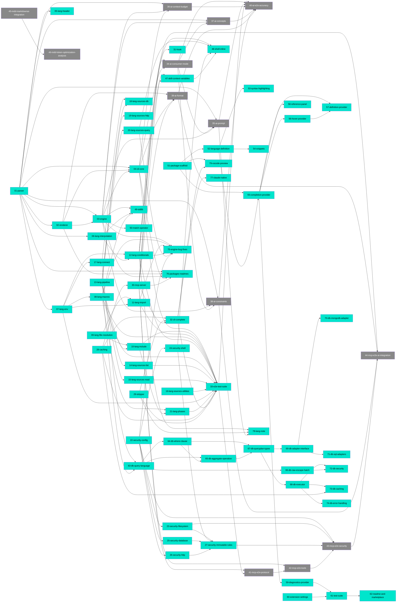

## Path Tree

```
├── AI/
│   ├── Concepts  37-ai-concepts  draft
│   ├── Constraints  38-ai-constraints  draft
│   ├── ConsumerMode  34-ai-consumer-mode  draft
│   ├── ContextBudget  36-ai-context-budget  draft
│   ├── Format  39-ai-format  draft
│   └── Prompt  35-ai-prompt  draft
├── DB/
│   ├── Adapters/
│   │   ├── 69-db-adapter-interface  complete
│   │   ├── 70-db-mongodb-adapter  complete
│   │   └── 71-db-sql-adapters  complete
│   ├── Caching  73-db-caching  complete
│   ├── Errors  74-db-error-handling  complete
│   ├── Internals/
│   │   ├── 67-db-queryplan-types  complete
│   │   └── 68-db-executor  complete
│   ├── Query Language/
│   │   ├── 63-db-query-language  complete
│   │   ├── 64-db-where-clause  complete
│   │   ├── 65-db-aggregate-operation  complete
│   │   └── 66-db-raw-escape-hatch  complete
│   └── Security  72-db-security  complete
├── Distribution/
│   └── Claude-Native  77-claude-native  complete
├── Engine/
│   ├── Conditions  47-skill-context-variables  complete
│   └── Security  48-shell-inline  complete
├── Integration/
│   └── MDD/
│       ├── 45-mdd-markdownai-integration  draft
│       └── 46-mdd-token-optimization-analysis  draft
├── Language/
│   ├── Conditionals  12-lang-conditionals  complete
│   ├── Connect  17-lang-connect  complete
│   ├── Env  07-lang-env  complete
│   ├── FileResolution  09-lang-file-resolution  complete
│   ├── Header  05-lang-header  complete
│   ├── Import  11-lang-import  complete
│   ├── Include  10-lang-include  complete
│   ├── Interpolation  06-lang-interpolation  complete
│   ├── Macros  08-lang-macros  complete
│   ├── Note  78-lang-note  complete
│   ├── Phases  21-lang-phases  complete
│   ├── Pipeline  13-lang-pipeline  complete
│   └── Sources/
│       ├── 14-lang-sources-list  complete
│       ├── 15-lang-sources-read  complete
│       ├── 16-lang-sources-utilities  complete
│       ├── 18-lang-sources-db  complete
│       ├── 19-lang-sources-http  complete
│       └── 20-lang-sources-query  complete
├── Security/
│   ├── 22-security-config  complete
│   ├── 23-security-filesystem  complete
│   ├── 24-security-shell  complete
│   ├── 25-security-database  complete
│   ├── 26-security-http  complete
│   └── 27-security-immutable-rules  complete
├── Testing/
│   ├── AI-E2E  40-ai-e2e-accuracy  draft
│   ├── E2E  33-e2e-test-suite  complete
│   └── MCP-E2E/
│       ├── 41-mcp-e2e-protocol  draft
│       ├── 42-mcp-e2e-tools  draft
│       ├── 43-mcp-e2e-security  draft
│       └── 44-mcp-e2e-ai-integration  draft
├── Toolchain/
│   ├── CLI/
│   │   ├── 04-cli-core  complete
│   │   └── 32-cli-complete  complete
│   ├── Cache  28-caching  complete
│   ├── Documentation  76-packages-readmes  complete
│   ├── Engine/
│   │   ├── 03-engine  complete
│   │   └── 75-engine-bug-fixes  complete
│   ├── Hook  31-hook  complete
│   ├── MCP  30-mcp-server  complete
│   ├── Parser  01-parser  complete
│   ├── Renderer  02-renderer  complete
│   └── Stripper  29-stripper  complete
├── VS Code Extension/
│   ├── Foundation/
│   │   ├── 51-package-scaffold  complete
│   │   ├── 52-language-definition  complete
│   │   ├── 53-syntax-highlighting  complete
│   │   ├── 54-snippets  complete
│   │   └── 60-extension-settings  complete
│   ├── Intelligence/
│   │   ├── 55-completion-provider  complete
│   │   ├── 56-hover-provider  complete
│   │   ├── 57-definition-provider  complete
│   │   ├── 58-reference-panel  complete
│   │   └── 79-vscode-preview  complete
│   └── Quality/
│       ├── 59-diagnostics-provider  complete
│       ├── 61-test-suite  complete
│       └── 62-readme-and-marketplace  complete
└── engine/
    ├── conditions  50-match-operator  complete
    └── stdlib  49-stdlib  complete
```

## Dependency Graph



## Source File Overlap

Files referenced by 2 or more docs:

- `packages/core/src/commands/build.ts` - 32-cli-complete, 34-ai-consumer-mode, 36-ai-context-budget, 39-ai-format
- `packages/core/src/commands/init.ts` - 31-hook, 32-cli-complete, 77-claude-native
- `packages/core/src/commands/render.ts` - 04-cli-core, 34-ai-consumer-mode, 36-ai-context-budget, 39-ai-format, 75-engine-bug-fixes
- `packages/core/src/commands/strip.ts` - 29-stripper, 32-cli-complete
- `packages/engine/src/__tests__/conditions.test.ts` - 47-skill-context-variables, 50-match-operator
- `packages/engine/src/cache.ts` - 03-engine, 28-caching
- `packages/engine/src/conditions.ts` - 03-engine, 06-lang-interpolation, 12-lang-conditionals, 34-ai-consumer-mode, 47-skill-context-variables, 50-match-operator, 75-engine-bug-fixes
- `packages/engine/src/context.ts` - 03-engine, 07-lang-env, 17-lang-connect, 47-skill-context-variables
- `packages/engine/src/db/adapters/mongodb.ts` - 65-db-aggregate-operation, 69-db-adapter-interface, 70-db-mongodb-adapter
- `packages/engine/src/db/adapters/mssql.ts` - 69-db-adapter-interface, 71-db-sql-adapters
- `packages/engine/src/db/adapters/mysql.ts` - 69-db-adapter-interface, 71-db-sql-adapters
- `packages/engine/src/db/adapters/postgres.ts` - 65-db-aggregate-operation, 69-db-adapter-interface, 71-db-sql-adapters
- `packages/engine/src/db/adapters/sqlite.ts` - 69-db-adapter-interface, 71-db-sql-adapters
- `packages/engine/src/db/executor.ts` - 66-db-raw-escape-hatch, 68-db-executor, 72-db-security, 73-db-caching, 74-db-error-handling
- `packages/engine/src/db/query.ts` - 63-db-query-language, 64-db-where-clause, 65-db-aggregate-operation, 67-db-queryplan-types, 68-db-executor, 74-db-error-handling
- `packages/engine/src/engine.ts` - 03-engine, 09-lang-file-resolution, 10-lang-include, 11-lang-import, 14-lang-sources-list, 15-lang-sources-read, 16-lang-sources-utilities, 18-lang-sources-db, 19-lang-sources-http, 21-lang-phases, 47-skill-context-variables, 48-shell-inline, 49-stdlib, 75-engine-bug-fixes, 78-lang-note
- `packages/engine/src/macros.ts` - 03-engine, 08-lang-macros
- `packages/engine/src/pipe.ts` - 03-engine, 13-lang-pipeline
- `packages/engine/src/shell.ts` - 03-engine, 20-lang-sources-query
- `packages/engine/src/stripper.ts` - 29-stripper, 78-lang-note
- `packages/mcp/src/server.ts` - 30-mcp-server, 39-ai-format, 47-skill-context-variables
- `packages/mcp/src/tools/read_file.ts` - 30-mcp-server, 47-skill-context-variables
- `packages/parser/src/directives/call.ts` - 01-parser, 08-lang-macros
- `packages/parser/src/directives/connect.ts` - 01-parser, 17-lang-connect
- `packages/parser/src/directives/count.ts` - 01-parser, 16-lang-sources-utilities
- `packages/parser/src/directives/date.ts` - 01-parser, 16-lang-sources-utilities
- `packages/parser/src/directives/db.ts` - 01-parser, 18-lang-sources-db, 63-db-query-language
- `packages/parser/src/directives/define.ts` - 01-parser, 08-lang-macros
- `packages/parser/src/directives/env.ts` - 01-parser, 07-lang-env
- `packages/parser/src/directives/graph.ts` - 01-parser, 21-lang-phases
- `packages/parser/src/directives/header.ts` - 01-parser, 05-lang-header
- `packages/parser/src/directives/http.ts` - 01-parser, 19-lang-sources-http
- `packages/parser/src/directives/if.ts` - 01-parser, 12-lang-conditionals
- `packages/parser/src/directives/import.ts` - 01-parser, 11-lang-import
- `packages/parser/src/directives/include.ts` - 01-parser, 10-lang-include
- `packages/parser/src/directives/list.ts` - 01-parser, 14-lang-sources-list
- `packages/parser/src/directives/phase.ts` - 01-parser, 21-lang-phases
- `packages/parser/src/directives/pipe.ts` - 01-parser, 13-lang-pipeline
- `packages/parser/src/directives/query.ts` - 01-parser, 20-lang-sources-query
- `packages/parser/src/directives/read.ts` - 01-parser, 15-lang-sources-read
- `packages/parser/src/directives/render.ts` - 01-parser, 13-lang-pipeline
- `packages/parser/src/directives/tree.ts` - 01-parser, 16-lang-sources-utilities
- `packages/parser/src/interpolation.ts` - 06-lang-interpolation, 48-shell-inline
- `packages/parser/src/parser.ts` - 01-parser, 48-shell-inline
- `packages/parser/src/registry.ts` - 01-parser, 78-lang-note
- `packages/parser/src/types.ts` - 01-parser, 78-lang-note
- `packages/renderer/src/renderer.ts` - 02-renderer, 13-lang-pipeline
- `packages/vscode/package.json` - 51-package-scaffold, 52-language-definition, 53-syntax-highlighting, 54-snippets, 79-vscode-preview
- `packages/vscode/src/extension.ts` - 51-package-scaffold, 52-language-definition, 55-completion-provider, 79-vscode-preview

## Warnings

None
