# MDD Connections

## Path Tree

```
AI/
├── ConsumerMode
│   └── 34-ai-consumer-mode  draft
├── Concepts
│   └── 37-ai-concepts  draft
├── Constraints
│   └── 38-ai-constraints  draft
├── ContextBudget
│   └── 36-ai-context-budget  draft
├── Format
│   └── 39-ai-format  draft
└── Prompt
    └── 35-ai-prompt  draft
Engine/
├── Conditions
│   └── 47-skill-context-variables  complete
└── Security
    └── 48-shell-inline  complete
Integration/
└── MDD
    ├── 45-mdd-markdownai-integration  draft
    └── 46-mdd-token-optimization-analysis  draft
Language/
├── Conditionals
│   └── 12-lang-conditionals  complete
├── Connect
│   └── 17-lang-connect  complete
├── Env
│   └── 07-lang-env  complete
├── FileResolution
│   └── 09-lang-file-resolution  complete
├── Header
│   └── 05-lang-header  complete
├── Import
│   └── 11-lang-import  complete
├── Include
│   └── 10-lang-include  complete
├── Interpolation
│   └── 06-lang-interpolation  complete
├── Macros
│   └── 08-lang-macros  complete
├── Phases
│   └── 21-lang-phases  complete
├── Pipeline
│   └── 13-lang-pipeline  complete
└── Sources
    ├── 14-lang-sources-list  complete
    ├── 15-lang-sources-read  complete
    ├── 16-lang-sources-utilities  complete
    ├── 18-lang-sources-db  complete
    ├── 19-lang-sources-http  complete
    └── 20-lang-sources-query  complete
Security/
├── 22-security-config  complete
├── 23-security-filesystem  complete
├── 24-security-shell  complete
├── 25-security-database  complete
├── 26-security-http  complete
└── 27-security-immutable-rules  complete
Testing/
├── AI-E2E
│   └── 40-ai-e2e-accuracy  draft
├── E2E
│   └── 33-e2e-test-suite  complete
└── MCP-E2E
    ├── 41-mcp-e2e-protocol  draft
    ├── 42-mcp-e2e-tools  draft
    ├── 43-mcp-e2e-security  draft
    └── 44-mcp-e2e-ai-integration  draft
Toolchain/
├── Cache
│   └── 28-caching  complete
├── CLI
│   ├── 04-cli-core  complete
│   └── 32-cli-complete  complete
├── Engine
│   └── 03-engine  complete
├── Hook
│   └── 31-hook  complete
├── MCP
│   └── 30-mcp-server  complete
├── Parser
│   └── 01-parser  complete
├── Renderer
│   └── 02-renderer  complete
└── Stripper
    └── 29-stripper  complete
VS Code Extension/
└── Foundation
    ├── 51-package-scaffold  complete
    ├── 52-language-definition  complete
    ├── 53-syntax-highlighting  complete
    └── 54-snippets  complete
engine/              [WARNING: inconsistent casing - see Warnings]
├── conditions
│   └── 50-match-operator  complete
└── stdlib
    └── 49-stdlib  complete
```

## Dependency Graph

```mermaid
graph TD
  d01[01-parser]:::complete
  d02[02-renderer]:::complete
  d03[03-engine]:::complete
  d04[04-cli-core]:::complete
  d05[05-lang-header]:::complete
  d06[06-lang-interpolation]:::complete
  d07[07-lang-env]:::complete
  d08[08-lang-macros]:::complete
  d09[09-lang-file-resolution]:::complete
  d10[10-lang-include]:::complete
  d11[11-lang-import]:::complete
  d12[12-lang-conditionals]:::complete
  d13[13-lang-pipeline]:::complete
  d14[14-lang-sources-list]:::complete
  d15[15-lang-sources-read]:::complete
  d16[16-lang-sources-utilities]:::complete
  d17[17-lang-connect]:::complete
  d18[18-lang-sources-db]:::complete
  d19[19-lang-sources-http]:::complete
  d20[20-lang-sources-query]:::complete
  d21[21-lang-phases]:::complete
  d22[22-security-config]:::complete
  d23[23-security-filesystem]:::complete
  d24[24-security-shell]:::complete
  d25[25-security-database]:::complete
  d26[26-security-http]:::complete
  d27[27-security-immutable-rules]:::complete
  d28[28-caching]:::complete
  d29[29-stripper]:::complete
  d30[30-mcp-server]:::complete
  d31[31-hook]:::complete
  d32[32-cli-complete]:::complete
  d33[33-e2e-test-suite]:::complete
  d34[34-ai-consumer-mode]:::draft
  d35[35-ai-prompt]:::draft
  d36[36-ai-context-budget]:::draft
  d37[37-ai-concepts]:::draft
  d38[38-ai-constraints]:::draft
  d39[39-ai-format]:::draft
  d40[40-ai-e2e-accuracy]:::draft
  d41[41-mcp-e2e-protocol]:::draft
  d42[42-mcp-e2e-tools]:::draft
  d43[43-mcp-e2e-security]:::draft
  d44[44-mcp-e2e-ai-integration]:::draft
  d45[45-mdd-integration]:::draft
  d46[46-mdd-token-analysis]:::draft
  d47[47-skill-context-vars]:::complete
  d48[48-shell-inline]:::complete
  d49[49-stdlib]:::complete
  d50[50-match-operator]:::complete
  d51[51-package-scaffold]:::complete
  d52[52-language-definition]:::complete
  d53[53-syntax-highlighting]:::complete
  d54[54-snippets]:::complete

  d02 --> d01
  d03 --> d01
  d03 --> d02
  d04 --> d01
  d04 --> d02
  d04 --> d03
  d05 --> d01
  d06 --> d01
  d07 --> d01
  d08 --> d07
  d10 --> d09
  d10 --> d08
  d11 --> d09
  d11 --> d07
  d12 --> d07
  d12 --> d06
  d14 --> d13
  d15 --> d13
  d17 --> d07
  d18 --> d17
  d18 --> d13
  d19 --> d13
  d20 --> d13
  d21 --> d08
  d21 --> d10
  d23 --> d22
  d24 --> d22
  d25 --> d22
  d26 --> d22
  d27 --> d23
  d27 --> d24
  d27 --> d25
  d27 --> d26
  d30 --> d28
  d31 --> d30
  d32 --> d28
  d32 --> d29
  d32 --> d30
  d33 --> d04
  d33 --> d07
  d33 --> d08
  d33 --> d10
  d33 --> d11
  d33 --> d12
  d33 --> d13
  d33 --> d14
  d33 --> d15
  d33 --> d16
  d33 --> d21
  d33 --> d28
  d33 --> d29
  d33 --> d32
  d34 --> d12
  d34 --> d04
  d35 --> d01
  d35 --> d03
  d35 --> d34
  d36 --> d01
  d36 --> d03
  d36 --> d04
  d37 --> d01
  d37 --> d03
  d37 --> d34
  d38 --> d01
  d38 --> d03
  d38 --> d34
  d39 --> d02
  d39 --> d04
  d39 --> d30
  d40 --> d33
  d40 --> d34
  d40 --> d35
  d40 --> d36
  d40 --> d37
  d40 --> d38
  d40 --> d39
  d41 --> d30
  d41 --> d33
  d42 --> d30
  d42 --> d41
  d43 --> d22
  d43 --> d23
  d43 --> d27
  d43 --> d42
  d44 --> d30
  d44 --> d39
  d44 --> d38
  d44 --> d43
  d46 --> d45
  d47 --> d12
  d47 --> d30
  d48 --> d12
  d48 --> d20
  d48 --> d24
  d48 --> d47
  d49 --> d03
  d49 --> d06
  d49 --> d08
  d50 --> d03
  d52 --> d51
  d53 --> d52
  d54 --> d52

  classDef complete fill:#00e5cc,color:#000
  classDef in_progress fill:#ffaa00,color:#000
  classDef draft fill:#888,color:#fff
  classDef deprecated fill:#555,color:#aaa
```



## Source File Overlap

Files referenced by 2 or more feature docs:

| Source File | Referenced by |
|------------|--------------|
| `packages/engine/src/engine.ts` | 03, 09, 10, 11, 14, 15, 16, 18, 19, 21, 48, 49 |
| `packages/engine/src/conditions.ts` | 06, 12, 47, 48, 50 |
| `packages/engine/src/context.ts` | 07, 17, 47 |
| `packages/core/src/commands/render.ts` | 04, 34, 36, 39 |
| `packages/core/src/commands/build.ts` | 34, 36, 39 |
| `packages/mcp/src/server.ts` | 30, 39, 47 |
| `packages/vscode/package.json` | 51, 52, 53, 54 |
| `packages/vscode/src/extension.ts` | 51, 52 |
| `packages/engine/src/__tests__/conditions.test.ts` | 47, 50 |

## Warnings

- **Path casing inconsistency:** Features 49 (`engine/stdlib`) and 50 (`engine/conditions`) use lowercase paths while similar features use Title Case (`Engine/Conditions`, `Engine/Security`). These should be normalized to `Engine/Stdlib` and `Engine/Conditions` respectively.
- **Source file overlap on `packages/engine/src/engine.ts`:** 12 feature docs reference this file. At 300-line limit risk - monitor closely.
- **Draft features blocked by incomplete deps:** Features 35-39 (AI/*) are draft and depend on 34-ai-consumer-mode which is also draft. Feature 40 depends on all of them. The entire AI wave needs to be executed before E2E testing can proceed.
- **No circular dependencies detected.**
- **No broken depends_on references detected.**
